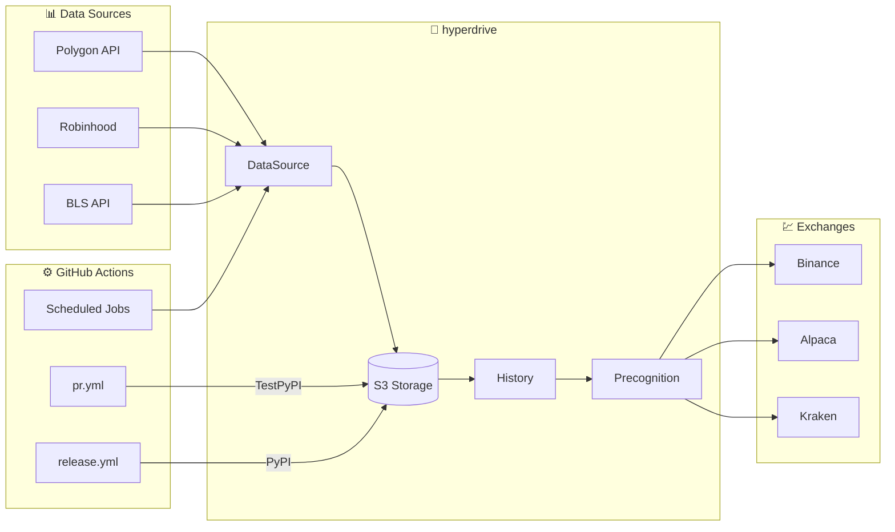

# hyperdrive

|  | **_hyperdrive_**: an algorithmic trading library |
| -------------------------------------------------------------------------------------------------------------- | ------------------------------------------------ |

[](https://github.com/suchak1/hyperdrive/actions/workflows/release.yml)
[](https://github.com/suchak1/hyperdrive/actions/workflows/pr.yml)
[](https://pypi.org/project/hyperdrive/)
[](https://www.python.org/downloads/)
[](https://opensource.org/licenses/MIT)
[](https://pepy.tech/project/hyperdrive)

**_hyperdrive_** is an algorithmic trading library that powers quant research firm [ **Algotrade.io**](https://algotrade.io).

Unlike other backtesting libraries, _`hyperdrive`_ specializes in data collection and quantitative research.

## ✨ Features

- **Data Collection**: Aggregate market data from Polygon, Robinhood, and BLS
- **Cloud Storage**: Seamless S3 integration for historical data
- **Backtesting**: Strategy testing with [vectorbt](https://vectorbt.dev/)
- **AI/ML**: Machine learning predictions with AutoGluon
- **Exchange Support**: Trade on Binance, Alpaca, and Kraken
- **CI/CD Ready**: GitHub Actions workflows for automated data updates

## 💖 Support

Love this tool? Your support means the world! ❤️

<table align="center">
  <tr>
    <th>Currency</th>
    <th>Address</th>
    <th>QR</th>
  </tr>
  <tr>
    <td><strong>₿ BTC</strong></td>
    <td><code>bc1qwn7ea6s8wqx66hl5rr2supk4kv7qtcxnlqcqfk</code></td>
    <td></td>
  </tr>
  <tr>
    <td><strong>Ξ ETH</strong></td>
    <td><code>0x7cdB1861AC1B4385521a6e16dF198e7bc43fDE5f</code></td>
    <td></td>
  </tr>
  <tr>
    <td><strong>ɱ XMR</strong></td>
    <td><code>463fMSWyDrk9DVQ8QCiAir8TQd4h3aRAiDGA8CKKjknGaip7cnHGmS7bQmxSiS2aYtE9tT31Zf7dSbK1wyVARNgA9pkzVxX</code></td>
    <td></td>
  </tr>
  <tr>
    <td><strong>◈ BNB</strong></td>
    <td><code>0x7cdB1861AC1B4385521a6e16dF198e7bc43fDE5f</code></td>
    <td></td>
  </tr>
</table>

## 📦 Installation

### PyPI (Recommended)

```bash
pip install hyperdrive -U
```

Or with uv:

```bash
uv pip install hyperdrive
```

### From Source

Clone the repository and install in development mode:

```bash
git clone https://github.com/suchak1/hyperdrive.git
cd hyperdrive
make install DEV=1  # Install with dev dependencies
```

## 🚀 Examples

Most secrets must be passed as environment variables. Future updates will allow secrets to be passed directly into class objects (see example on order execution).

### 1. Storing data

Pre-requisites:

- a Polygon API key
- an AWS account and an S3 bucket

Environment Variables:

- `POLYGON`
- `AWS_ACCESS_KEY_ID`
- `AWS_SECRET_ACCESS_KEY`
- `AWS_DEFAULT_REGION`
- `S3_BUCKET`

```python
from hyperdrive import DataSource
from DataSource import Polygon, MarketData

# Polygon API token loaded as an environment variable (os.environ['POLYGON'])

symbol = 'TSLA'
timeframe = '7d'

md = MarketData()
poly = Polygon()

poly.save_ohlc(symbol=symbol, timeframe=timeframe)
df = md.get_ohlc(symbol=symbol, timeframe=timeframe)

print(df)
```

Output:

```
           Time     Open       High      Low    Close       Vol
2863 2021-11-10  1010.41  1078.1000   987.31  1067.95  42802722
2864 2021-11-11  1102.77  1104.9700  1054.68  1063.51  22396568
2865 2021-11-12  1047.50  1054.5000  1019.20  1033.42  25573148
2866 2021-11-15  1017.63  1031.9800   978.60  1013.39  34775649
2867 2021-11-16  1003.31  1057.1999  1002.18  1054.73  26542359
```

### 2. Creating a model

Much of this code is still closed-source, but you can take a look at the [`Historian` class in the `History` module](https://github.com/suchak1/hyperdrive/blob/master/hyperdrive/History.py) for some ideas.

### 3. Backtesting a strategy

We use [_vectorbt_](https://vectorbt.dev/) to backtest strategies.

```python
from hyperdrive import History, DataSource, Constants as C
from History import Historian
from DataSource import MarketData

hist = Historian()
md = MarketData()

symbol = 'TSLA'
timeframe = '1y'

df = md.get_ohlc(symbol=symbol, timeframe=timeframe)

holding = hist.from_holding(df[C.CLOSE])
signals = hist.get_optimal_signals(df[C.CLOSE])
my_strat = hist.from_signals(df[C.CLOSE], signals)

metrics = [
    'Total Return [%]', 'Benchmark Return [%]',
    'Max Drawdown [%]', 'Max Drawdown Duration',
    'Total Trades', 'Win Rate [%]', 'Avg Winning Trade [%]',
    'Avg Losing Trade [%]', 'Profit Factor',
    'Expectancy', 'Sharpe Ratio', 'Calmar Ratio',
    'Omega Ratio', 'Sortino Ratio'
]

holding_stats = holding.stats()[metrics]
my_strat_stats = my_strat.stats()[metrics]

print(f'Buy and Hold Strat\n{"-"*42}')
print(holding_stats)

print(f'My Strategy\n{"-"*42}')
print(my_strat_stats)

# holding.plot()
my_strat.plot()
```

Output:

```
Buy and Hold Strat
------------------------------------------
Total Return [%]                138.837436
Benchmark Return [%]            138.837436
Max Drawdown [%]                 36.246589
Max Drawdown Duration    186 days 00:00:00
Total Trades                             1
Win Rate [%]                           NaN
Avg Winning Trade [%]                  NaN
Avg Losing Trade [%]                   NaN
Profit Factor                          NaN
Expectancy                             NaN
Sharpe Ratio                      2.206485
Calmar Ratio                      6.977133
Omega Ratio                       1.381816
Sortino Ratio                     3.623509
Name: Close, dtype: object

My Strategy
------------------------------------------
Total Return [%]                364.275727
Benchmark Return [%]            138.837436
Max Drawdown [%]                  35.49422
Max Drawdown Duration    122 days 00:00:00
Total Trades                             6
Win Rate [%]                          80.0
Avg Winning Trade [%]            52.235227
Avg Losing Trade [%]             -3.933059
Profit Factor                     45.00258
Expectancy                      692.157004
Sharpe Ratio                      4.078172
Calmar Ratio                     23.220732
Omega Ratio                       2.098986
Sortino Ratio                     7.727806
Name: Close, dtype: object
```


### 4. Executing an order

Pre-requisites:

- a Binance.US API key

Environment Variables:

- `BINANCE`

```python
from pprint import pprint
from hyperdrive import Exchange
from Exchange import Binance

# Binance API token loaded as an environment variable (os.environ['BINANCE'])

bn = Binance()

# use 45% of your USD account balance to buy BTC
order = bn.order('BTC', 'USD', 'BUY', 0.45)

pprint(order)
```

Output:

```
{'clientOrderId': '3cfyrJOSXqq6Zl1RJdeRRC',
 'cummulativeQuoteQty': 46.8315,
 'executedQty': 0.000757,
 'fills': [{'commission': '0.0500',
            'commissionAsset': 'USD',
            'price': '61864.6400',
            'qty': '0.00075700',
            'tradeId': 25803914}],
 'orderId': 714855908,
 'orderListId': -1,
 'origQty': 0.000757,
 'price': 0.0,
 'side': 'SELL',
 'status': 'FILLED',
 'symbol': 'BTCUSD',
 'timeInForce': 'GTC',
 'transactTime': 1637030680121,
 'type': 'MARKET'}
```

## 🏗️ Architecture

### Project Structure

```
hyperdrive/
├── hyperdrive/              # Core package
│   ├── DataSource.py       # Market data providers (Polygon, Robinhood)
│   ├── Exchange.py         # Trading integrations (Binance, Alpaca, Kraken)
│   ├── History.py          # Backtesting with vectorbt
│   ├── Precognition.py     # ML predictions with AutoGluon
│   ├── Storage.py          # S3 cloud storage
│   ├── Broker.py           # Order execution
│   ├── Constants.py        # Shared constants
│   └── _version.py         # Package version
├── scripts/                 # Automation & data update scripts
├── tests/                   # Unit and integration tests
├── .github/workflows/       # CI/CD pipelines
│   ├── pr.yml              # PR checks + TestPyPI
│   ├── release.yml         # Release + PyPI
│   ├── test.yml            # Reusable test workflow
│   └── *.yml               # Data collection jobs
└── pyproject.toml          # Project configuration
```

### End-to-End Flow



## 🧪 Testing

Run the test suite:

```bash
make test
```

Run with coverage reporting:

```bash
make cov
```

Run smoke tests:

```bash
make smoke
```

## 📊 Data Collection

Use the scripts provided in the [`scripts/`](https://github.com/suchak1/hyperdrive/tree/master/scripts) directory as a reference since they are actually used in production daily.

Available data collection workflows:

- [](https://github.com/suchak1/hyperdrive/actions?query=workflow%3ASymbols) (from Robinhood)
- [](https://github.com/suchak1/hyperdrive/actions?query=workflow%3AOHLC) (from Polygon)
- [](https://github.com/suchak1/hyperdrive/actions?query=workflow%3AIntraday) (from Polygon)
- [](https://github.com/suchak1/hyperdrive/actions?query=workflow%3ADividends) (from Polygon)
- [](https://github.com/suchak1/hyperdrive/actions?query=workflow%3ASplits) (from Polygon)
- [](https://github.com/suchak1/hyperdrive/actions?query=workflow%3AUnemployment) (from Bureau of Labor Statistics)

## 📄 License

MIT License — see [LICENSE](LICENSE) for details.
